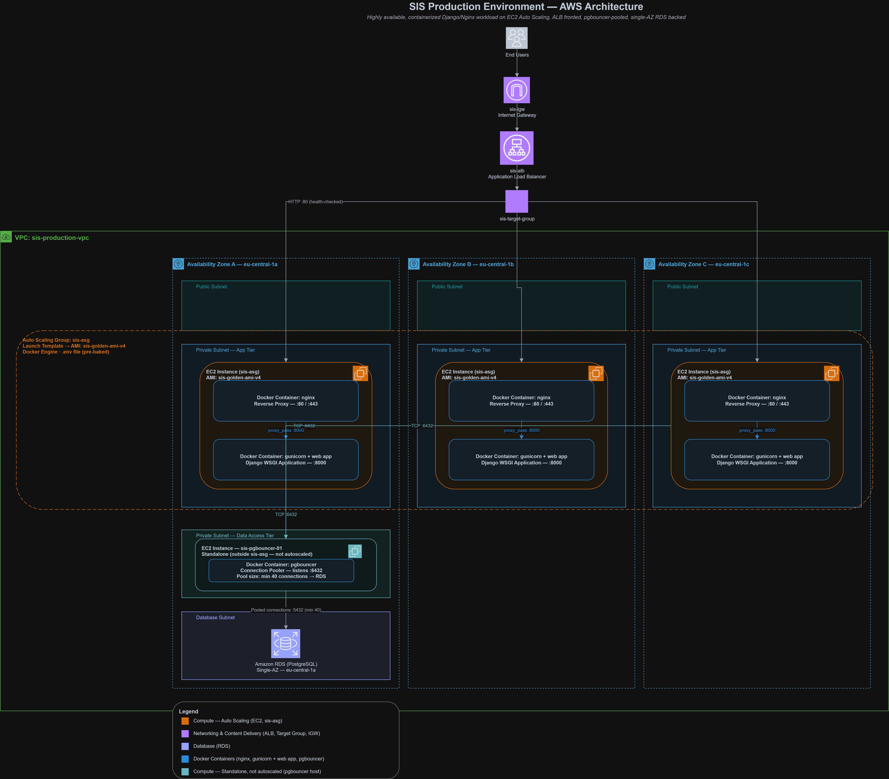
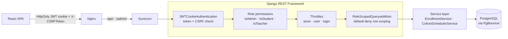
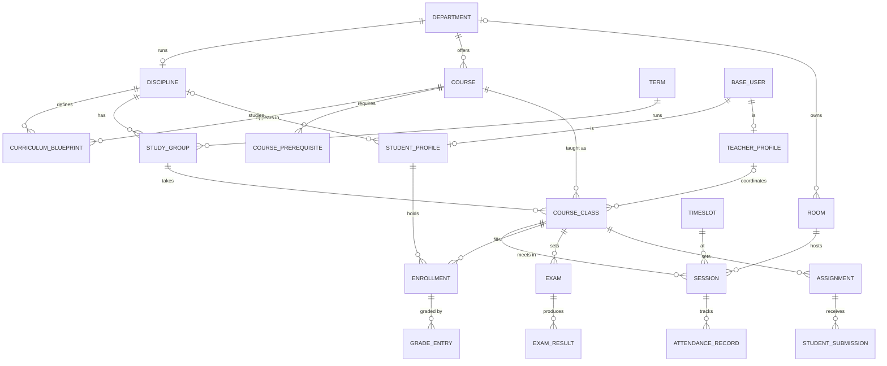

https://github.com/user-attachments/assets/ff76001a-bb46-49aa-8835-c0ad63ce9137

<div align="center">

# University Management System (SIS)

A full-stack Student Information System that runs academics, enrollment, and academic records for a university, with timetables generated automatically by a CP-SAT constraint solver.
Built on Django REST Framework and React + TypeScript, containerized with Docker, and deployed on auto-scaling AWS infrastructure.

<br>

<!-- Demo video: on GitHub, drag the .mp4 into this README in the web editor to get an embeddable link, then replace the line below. -->
**[Insert 54s Motion Graphics Demo Video Here]**

</div>

---

## Quick Links

| Resource | Link |
| --- | --- |
| **Live Demo** | [Insert Live Demo URL] |
| **Database & Authentication Design** (75-slide presentation) | [School_Management_Sys_Db&Auth_presentation.pdf](School_Management_Sys_Db%26Auth_presentation.pdf) |
| **OpenAPI 3 Schema** | [openapi.json](openapi.json) · interactive Swagger UI at `http://localhost/api/docs/` when running locally |
| **Production Architecture Diagram** | [sis-production-architecture-v3.drawio.png](sis-production-architecture-v3.drawio.png) |

**Contents:** [Tech Stack](#tech-stack) · [Architecture](#architecture) · [Engineering Highlights](#engineering-highlights) · [Known Limitations](#known-limitations) · [Local Development Setup](#local-development-setup)

---

## Tech Stack

<p align="center">
  
  
  
  
  
  
  
  
  
</p>

| Layer | Technology | Role |
| --- | --- | --- |
| **Backend API** | Django REST Framework · Python 3.12 | REST API across four domain apps (users, academics, scheduling, records), with an OpenAPI 3 schema generated by drf-spectacular |
| **Authentication** | SimpleJWT | Access and refresh tokens in HttpOnly cookies, CSRF-checked, with refresh rotation and blacklisting |
| **Frontend** | React · TypeScript · Vite | Single-page application; TanStack Query for server state, Axios with silent token refresh |
| **Database** | PostgreSQL 15 | Primary data store; partial indexes, advisory locks, atomic conditional updates |
| **Connection Pooling** | PgBouncer (transaction mode) | Keeps warm server connections to RDS so bursts don't pay connection setup |
| **Scheduling Engine** | Google OR-Tools (CP-SAT) | Constraint-based timetable generation for each cohort in a term |
| **Containerization** | Docker · Docker Compose | Three-service stack (PostgreSQL, Gunicorn + Django, Nginx) with a multi-stage frontend build |
| **Web Server** | Nginx | Serves the compiled SPA and static assets; reverse-proxies `/api/` and `/admin/` to Gunicorn |
| **Cloud** | AWS EC2 Auto Scaling · Application Load Balancer · RDS · CloudWatch | Horizontally scaled compute behind a load balancer, backed by managed PostgreSQL |
| **Testing** | pytest · Locust | Authorization regression suite; load testing of the enrollment path |

---

## Architecture

### Production infrastructure

The application tier is stateless; all persistent state lives in Amazon RDS for PostgreSQL. An Application Load Balancer spreads traffic across EC2 instances in an Auto Scaling group. Each instance runs the containerized stack: Nginx serves the compiled React bundle and reverse-proxies API and admin traffic to Gunicorn-hosted Django. Database connections go through PgBouncer in transaction-pooling mode, and CloudWatch collects metrics and logs from every tier. Compute scales out and back in without moving any data.

<p align="center">
  
</p>

Transaction pooling shapes the code: a pooled server connection is handed to another client at every commit, so any Postgres lock the application relies on has to be transaction-scoped. The scheduler's concurrency lock is `pg_advisory_xact_lock`, released automatically at commit; a session-level advisory lock could outlive its transaction and leak to whichever client gets that connection next.

### Codebase layout

```
├── core/          settings, URL routing, pagination, admin-login throttling
├── users/         accounts and roles, JWT cookie auth, permissions, queryset scoping, throttles
├── academics/     departments, disciplines, terms, courses, rooms, study groups, course classes, cohorts, dashboards
├── scheduling/    timeslots, sessions, CP-SAT cohort scheduler
├── records/       enrollment and eligibility services, grades, exams, assignments, submissions, attendance
└── sis-frontend/  React + TypeScript SPA, built into the Nginx image
```

Each app follows the same three layers:

- **API layer** (`<app>/api/`): serializers validate input shape; views handle HTTP and nothing else.
- **Service layer** (`records/services/`, `scheduling/services/`): multi-step business rules such as enrollment validation and seat reservation, eligibility, and timetable solving. Services raise domain exceptions, and the view layer translates them into HTTP responses.
- **Model layer**: invariants that must hold no matter who writes the row: `full_clean()` on save for records, unique constraints, partial indexes.

| Domain exception | HTTP | Meaning |
| --- | --- | --- |
| `CapacityExceededError` | 409 | No seat left in a requested class; the whole enrollment rolls back |
| `TimetableConflictError` | 409 | A requested session overlaps one the student already has |
| `NotScheduledError` · `NoCourseClassesError` | 400 | The class or group has nothing to enroll in yet |
| `InfeasibleScheduleError` | 409 | CP-SAT proved no valid timetable exists under current bookings |
| `RescheduleConfirmationRequiredError` | 409 | Cohort already scheduled; response carries structured counts and requires `force=true` |

### Request lifecycle



### Domain model

Simplified to the core relationships; the full schema is covered in the [design presentation](School_Management_Sys_Db%26Auth_presentation.pdf).



A **cohort** (discipline, term, year level) is a virtual entity: it has no table, and is assembled from its study groups at read time. Students enroll in a study group, which enrolls them in every course class the group takes, each capped by `CourseClass.capacity`.

### Scheduling engine

Timetables are generated per cohort by `CohortSchedulerService` using Google OR-Tools CP-SAT.

- **Model.** One boolean variable per (session requirement, timeslot, eligible room). Each course contributes its lecture, tutorial and lab counts as requirements. Rooms are filtered by session type and department before variables are built, falling back to any room of the right type only when the department has none.
- **Hard constraints.** Every requirement gets exactly one timeslot and room; no room is double-booked; no study group is in two places at once; no teacher gives two lectures at once.
- **Cross-cohort consistency.** Room slots and teacher lecture slots already booked by other cohorts in the term are removed before variables exist, so the model only ever sees free capacity.
- **Concurrency.** The whole run holds `pg_advisory_xact_lock(term_id)`, acquired before booked slots are read, so two admins scheduling different cohorts of the same term can't both claim the same room. Different terms never contend.
- **Safe rescheduling.** Replacing an existing timetable requires `force=true`. That check runs before the solve rather than after a search of up to 60 seconds, and the 409 carries `stale_session_count` and `affected_enrollment_count` so the UI can show real numbers. `dry_run` returns a solution without persisting it.
- **Staleness tracking.** Reassigning a class's coordinator after scheduling sets `schedule_dirty`, so the cohort list reports "needs reschedule" even though the old sessions still exist.

---

## Engineering Highlights

### 1. Enrollment under load

A 500-student enrollment burst made the enroll endpoint look broken: my load tester reported a p99 of 37 seconds. I traced it layer by layer using server-side measurements and found three real bottlenecks stacked on top of each other: a lock convoy in the enrollment transaction, a CPU-bound database, and too few request slots on the app tier. The load tester was also inflating its own numbers. After fixing each layer, the worst-case server response time dropped from over 13 s to **2.6 s**, averaging about **0.6 s**.

My rule throughout: no fix without a measurement that proves the cause, and no "fixed" without a measurement after.

#### Test setup

| Area | Details |
| --- | --- |
| **Data** | ~10,000 students, ~135,000 enrollments and ~3,500 active classes in PostgreSQL |
| **Load** | Locust, 500 virtual students spawned at 50/s. Each enrolls into up to 4 classes from their own cohort, picked by the same eligibility service the enrollment page uses |
| **Auth** | JWTs minted in the prep script, so password hashing never shows up in the latency numbers |
| **Request path** | ALB → EC2 Auto Scaling group (t3.small, Nginx + Gunicorn with 4 workers × 50 threads) → PgBouncer (transaction pooling) → RDS PostgreSQL |
| **Server-side clocks** | ALB `TargetResponseTime`, Gunicorn access log (`%(D)s`), phase timers inside `EnrollmentService`, `pg_stat_activity`, RDS CloudWatch metrics |

#### Results

| # | Bottleneck | How I proved it | Fix | After |
| --- | --- | --- | --- | --- |
| 1 | Row lock held for the whole enroll transaction | The entire transaction ran under `SELECT ... FOR UPDATE`: 27 ms even with no other traffic | Moved every read and validation before the lock; batched the duplicate-course check into one query | Lock held for 14 ms in isolation |
| 2 | Lock convoy on popular classes | `pg_stat_activity` mid-test: 12 of the 15 longest-running queries waiting on `Lock`, some for 7+ s | Replaced `select_for_update()` with one atomic conditional `UPDATE` on a `seats_taken` counter | Lock waits down to 12–13 of ~70 active queries |
| 3 | Database CPU | RDS CPU peaking at ~98% with ~70 connections pinned (`db.t4g.micro`) | Resized to `db.t3.medium` | RDS CPU ~25%, 1–2 active queries during the test |
| 4 | App-tier request slots | ALB max ~7 s while app CPU sat at ~20% and the database was idle | Scaled the Auto Scaling group out to 5 instances | ALB max **2.6 s**, average ~0.6 s |
| 5 | Oversized write response | Enroll returned 8.81 KB of nested class, group, discipline, grade and cohort data | Slim `EnrollResultSerializer` | 1.04 KB; single request 459 ms → 220 ms |

#### How I found it

**Round 1: the lock was held too long.** `enroll()` locked the target `CourseClass` rows with `select_for_update()` at the top of the transaction and kept them locked through the timetable-conflict check, a `COUNT(*)` for capacity, and a save loop where each `Enrollment.save()` ran `full_clean()`: three validation queries plus the `INSERT`, per class. Only the capacity check and the inserts need the lock. I split `enroll()` into an unlocked phase (target lookup, already-enrolled check, timetable conflicts, and a duplicate-course check batched into one query) and a short locked phase, and let `save()` skip the per-row checks the batch already covered. Lock hold time in isolation dropped from 27 ms to 14 ms.

Under load, the numbers barely moved. So I stopped guessing and instrumented every layer.

**Round 2: finding where the time went.** I added request duration to Gunicorn's access log and phase timers inside `EnrollmentService`. Gunicorn's durations (up to 15.8 s) lined up with my own timers (up to 16.0 s), so requests weren't stuck in front of Django; the time was spent inside it, mostly in the locked phase (up to 13.7 s under load, versus 14 ms alone). Mid-test, `pg_stat_activity` showed 12 of the 15 longest-running queries blocked with `wait_event_type = 'Lock'`, all on `SELECT`s against `academics_courseclass`, and `pg_locks` held 55 ungranted locks. `EXPLAIN ANALYZE` on the class lookup came back as a 1.9 ms index scan, which ruled out a missing index.

That's a lock convoy. Alone, the locked phase took 14 ms. Under load, every query inside it slowed down, so each holder kept the row longer and everyone queued behind it waited longer still. The more round trips a lock spans, the more any slowdown turns into a queue.

The fix was to stop taking the lock myself. `CourseClass` got a `seats_taken` counter, and one statement claims a seat in every requested class:

```sql
UPDATE academics_courseclass
SET    seats_taken = seats_taken + 1
WHERE  id = ANY(%s) AND seats_taken < capacity
RETURNING id;
```

Any class missing from `RETURNING` is full: the service raises `CapacityExceededError` (HTTP 409) and `transaction.atomic()` rolls back the seats it did claim. Under PostgreSQL's default READ COMMITTED isolation, a second `UPDATE` on the same row waits for the first to commit, then re-checks `seats_taken < capacity` against the new value, so two students can't both take the last seat. There is still a row lock, but the `UPDATE` takes it right before the inserts and it ends at commit; the validation queries and the `COUNT(*)` no longer run while it's held. Unenrolling releases seats with an `F()` decrement inside the same transaction as the delete.

Lock waits dropped from most of the long-running queries to 12–13 of the ~65–70 active ones. The rest were executing.

**Round 3: the database ran out of CPU.** With queries no longer blocked, the database itself became the limit. CloudWatch showed RDS CPU peaking at ~98% with ~70 connections held open for the whole test, on a `db.t4g.micro` (2 burstable vCPUs, 1 GiB of RAM). I resized it to `db.t3.medium` and reran the same test: RDS CPU stayed around 25%, and `pg_stat_activity` showed 1–2 active queries under load.

**Round 4: low CPU is not spare capacity.** The ALB still reported a ~7 s max, while app CPU sat at ~20% and the database was nearly idle. That pointed to requests waiting for a free worker thread, which uses no CPU, so CPU percentage can't show that queue. Each instance has 200 request slots (4 Gunicorn workers × 50 threads), and the threads in a worker share one GIL, so a 500-user burst queues in front of the code. I scaled the Auto Scaling group out to 5 instances, and ALB `TargetResponseTime` dropped to a **2.6 s max**, averaging about 0.6 s.

**Round 5: the response did too much.** The enroll endpoint returned the full `EnrollmentSerializer`: nested class, study group, discipline and department objects, plus grades and cohort statistics, none of which a client needs right after enrolling. A slim `EnrollResultSerializer` returns IDs and the course code, and adds no queries because the service builds each `Enrollment` from `CourseClass` objects already loaded with `select_related("course", "group")`. The response shrank from 8.81 KB to 1.04 KB, and a single enroll request from my machine in Egypt to the Frankfurt region went from 459 ms to 220 ms, network included.

**Also tuned:** PgBouncer runs in transaction mode with 40 pre-warmed server connections (`min_pool_size` 0 → 40), so a burst doesn't wait for new TLS connections and Postgres backends to open on RDS. A partial index on `Enrollment(student) WHERE status = 'ENROLLED'` backs the per-student checks, mirroring the existing per-class index.

#### The load tester was inflating its own numbers

Locust reported latencies the server never saw. In one run it showed a 62.5 s max while the ALB's peak for the same window was ~13 s. After every fix above, it still reported a p99 of ~48 s while the ALB measured a 2.6 s max. Locust was running all 500 users as greenlets in a single Python process on my laptop; once that one core saturated, its own scheduling delay was counted as response time. Locust's docs recommend one process per CPU core for exactly this reason.

So every number in this section is server-side. Locust generates the load; the ALB, Gunicorn and Postgres report what happened.

#### Lessons

- **Measure at the server.** A load generator is software on finite hardware, and it can become the bottleneck it's supposed to measure.
- **A lock's cost is its hold time multiplied by the queue behind it.** Shrinking the hold helps. Not holding it across round trips helps more.
- **CPU percentage measures work, not waiting.** 20% CPU with a full request queue is still a full queue.
- **Every fix exposes the next bottleneck.** Lock → database CPU → app-tier slots. Re-measure after each change.

#### What I'd do next

- Run Locust with `--processes -1` or distributed workers until its numbers agree with the ALB's.
- Take row locks in a fixed order (`ORDER BY id`) in multi-class enrollments, so two overlapping study-group enrollments can't deadlock.
- Protect the denormalized counter: add `CHECK (seats_taken <= capacity)`, a scheduled drift check, and route the generic `EnrollmentViewSet` writes through `EnrollmentService`.
- Take a per-student advisory lock so two tabs from the same student can't both pass the unlocked checks.
- Bring the worst case under 1 s, the usual p99 target for user-facing APIs.

<sub>The ~13 s ALB reading was taken with CloudWatch's default Average statistic at 1-second resolution, which understates the true peak (Gunicorn logged requests up to 15.8 s at that stage). The 2.6 s figure uses the Maximum statistic.</sub>

### 2. Closing a Broken Object Level Authorization (BOLA) hole

Several endpoints decided *whose* data to return from an ID the client sent. The clearest case was the personal timetable: `GET /api/scheduling/schedule-sessions/?student=<id>` returned whichever student's schedule the number pointed to, and the same request without the parameter returned every session in the university, to any logged-in user. That is Broken Object Level Authorization, first on the [OWASP API Security Top 10](https://owasp.org/API-Security/editions/2023/en/0xa1-broken-object-level-authorization/). The root cause wasn't one view: filtering by a client-supplied `student` parameter was how the frontend requested every student record.

#### The fix: authorize in the queryset, not in each view

Instead of patching views one by one, every student-owned resource inherits one mixin, `RoleScopedQuerysetMixin`, which builds the queryset from the authenticated user's role:

```python
def scope_queryset(self, queryset):
    user = self.request.user
    role = getattr(user, "role", None)

    if role == BaseUser.Role.STUDENT:
        return queryset.filter(**{self.student_owner_lookup: user.id})
    if role == BaseUser.Role.ADMIN:
        return self._filter_by_requested_student(queryset)
    return queryset.none()
```

- **Default-deny.** Any role not explicitly handled (a teacher, a role added later, an anonymous request during schema generation) gets an empty queryset, not everything. A view that forgets to declare its owner path fails loudly with `ImproperlyConfigured` instead of silently returning unscoped rows.
- **Detail routes inherit it.** Scoping lives in `get_queryset()`, so `retrieve`, `update`, `destroy` and custom detail actions all pass through it. Another student's object returns 404, which also avoids confirming that the ID exists.
- **Ownership comes from the token, never the request.** For students, `?student=` is ignored entirely. Each viewset declares one path from the row to its owner: `student__user_id` for an enrollment, `course_class__enrollments__student__user_id` for an exam. Admins can still filter by student explicitly.
- **Coverage.** Enrollments, grades, exams, exam results, assignments, submissions, attendance, sessions and student profiles. The timetable endpoint derives its scope from the caller's own student or teacher profile and returns an empty schedule to anyone else.

#### Write paths

- **No mass assignment of ownership or grades.** On `StudentSubmission`, `student` and `score` are read-only in the serializer; `perform_create` sets the owner from `request.user`, so a student can't submit as someone else or grade their own work. Grading goes through a separate admin-only `PATCH /student-submissions/{id}/grade/` with a one-field serializer.
- **Object checks on custom actions.** `dashboard-summary` rejects a student asking for another student's ID. `live-capacities` filters the requested class IDs down to the caller's own discipline in the active term, in the same query that reads capacities.
- **No self-registration.** Accounts are provisioned by administrators only; the user endpoints are admin-only.

#### Proof

A parameterized pytest suite logs in as one student and requests another student's objects on every scoped endpoint, asserting 403/404 each time, and asserts that disallowed HTTP methods are rejected. The tests exist so the hole can't quietly reopen when a new endpoint is added.

### 3. Authentication and traffic control

- **Tokens never reach JavaScript.** Access and refresh JWTs live in HttpOnly, `SameSite=Strict` cookies, so an XSS payload can't read them. The refresh cookie is path-scoped to `/api/auth/`, so it isn't sent with ordinary API calls. Refresh tokens rotate on every use, the old one is blacklisted, and logout blacklists the current one server-side.
- **CSRF on cookie auth.** Browsers attach cookies automatically, so `JWTCookieAuthentication` runs Django's CSRF check on every unsafe request authenticated by cookie, and the SPA echoes the `csrftoken` cookie as `X-CSRFToken` through Axios. Requests using an `Authorization` header (curl, Postman) skip the check, since a browser never adds that header to a cross-site request on its own.
- **Silent refresh without a stampede.** On a 401, the Axios interceptor refreshes once, shares that in-flight refresh across every request that failed at the same time, then retries them.

| Throttle scope | Limit | Keyed by | Why |
| --- | --- | --- | --- |
| `anon` | 100/min | Client IP from `X-Forwarded-For`, trusting only known proxy hops | Generous because a whole campus can share one NAT IP |
| `user` | 300/min | User | The enrollment page polls live capacities every 5 s |
| `login` | 5/min | Target email | Password guessing targets an account; rotating IPs doesn't help |
| `admin_login` | 5/min | IP **and** username | `/admin/` is a plain Django view DRF throttles never see, so its login view is wrapped |

### 4. Smaller things worth a look

- **Dashboard counts without a wide join.** Annotating class rows with `Count("enrollments", filter=...)` made Postgres join the entire enrollment history (about 6× the active rows) and group by every selected column: 80 ms+ for ~350 rows. The dashboards now load classes first, then count `ENROLLED` rows per class in one `course_class_id IN (...)` aggregate that a partial index serves.
- **Partial indexes where the data is skewed.** Historical enrollments vastly outnumber active ones, so `Enrollment(course_class)` and `Enrollment(student)` are indexed `WHERE status = 'ENROLLED'`.
- **Fixed query count for eligibility.** A student's available study groups, with sessions, enrollment state and remaining seats, are built from a fixed number of batched queries, however many groups exist.
- **Pagination that can't skip rows.** Every list endpoint paginates (50 per page, capped at 500), and an unordered queryset falls back to `ORDER BY pk`, since offset pagination over an unordered result can repeat or skip rows between pages.

---

## Known Limitations

- **Throttle counters are per process.** No shared cache is configured, so each Gunicorn worker counts separately and limits scale with workers × instances. Pointing Django's cache at Redis (e.g. ElastiCache) makes them exact.
- **Auth cookies are issued without the `Secure` flag** until TLS is enabled end to end.
- **Teacher conflicts cover lectures only.** A course class records who gives the lecture; tutorials and labs, which may be run by teaching assistants, don't record a teacher yet. A per-session teacher field would let the scheduler check those too.
- Enrollment follow-ups are listed under [What I'd do next](#what-id-do-next).

---

## Local Development Setup

The whole stack (database, API, and frontend) runs locally through Docker Compose. Nothing else needs to be installed on the host.

### Prerequisites

- [Docker Desktop](https://www.docker.com/products/docker-desktop/), or Docker Engine with the Compose v2 plugin
- Git
- Port `80` free on the host

### 1. Clone the repository

```bash
git clone https://github.com/AbdulRahman-cy/School-Management-System.git
cd School-Management-System
```

### 2. Configure environment variables

```bash
cp .env.example .env
```

> On Windows PowerShell, use `Copy-Item .env.example .env`.

Open `.env` and set `SECRET_KEY` and `POSTGRES_PASSWORD`. To generate a secret key:

```bash
python -c "import secrets; print(secrets.token_urlsafe(50))"
```

### 3. Build and start the stack

```bash
docker compose up --build
```

This builds the Django image, compiles the React frontend in a multi-stage Nginx build, and starts the `db`, `web`, and `nginx` services.

### 4. Initialize the database

In a second terminal, while the stack is running:

```bash
docker compose exec web python manage.py migrate
docker compose exec web python manage.py createsuperuser
```

`createsuperuser` asks for an email, first name, last name, and role. Enter `ADMIN` for the role.

### 5. Open the application

| Service | URL |
| --- | --- |
| Web application | http://localhost |
| Swagger UI | http://localhost/api/docs/ |
| Django admin | http://localhost/admin/ |

### Running the tests

```bash
docker compose exec web pytest
```

### Stopping the stack

```bash
docker compose down      # stop and remove containers
docker compose down -v   # also delete the database volume
```
