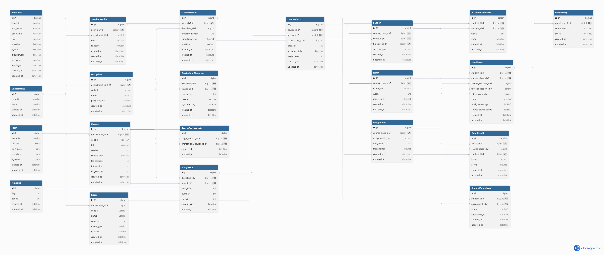

# Database Schema

The full PostgreSQL schema behind the SIS: 21 tables across four Django apps, with every unique constraint and index. It is tested against a seeded dataset of **10,000 students, 134,615 enrollments and 400,000+ exam results**.

| Format | Link | Use it for |
| --- | --- | --- |
| **Interactive** | [Open on dbdiagram.io](https://dbdiagram.io/d/INSERT-SHARE-LINK) | Zoom, click tables, follow relationships |
| **Image** | [schema.png](schema.png) | Quick look without leaving GitHub |
| **Source** | [schema.dbml](schema.dbml) | The schema as code: diffable and versioned |

  

---

## Tables by app

| App | Tables | Owns |
| --- | --- | --- |
| `users` | `BaseUser`, `StudentProfile`, `TeacherProfile` | Identity and roles (ADMIN, TEACHER, STUDENT); profiles are 1:1 with a user and soft-deleted |
| `academics` | `Department`, `Discipline`, `Term`, `Course`, `CoursePrerequisite`, `CurriculumBlueprint`, `Room`, `StudyGroup`, `CourseClass` | The catalog and who takes what: study groups per cohort, course classes per group |
| `scheduling` | `Timeslot`, `Session` | When and where each course class meets, produced by the CP-SAT scheduler |
| `records` | `Enrollment`, `GradeEntry`, `AttendanceRecord`, `Exam`, `ExamResult`, `Assignment`, `StudentSubmission` | Everything that happens to a student during a term |

---

## Design decisions

- **Partial indexes where the data is skewed.** `Enrollment` is indexed on `course_class_id` and on `student_id` only `WHERE status = 'ENROLLED'`. Historical enrollments vastly outnumber active ones, so the indexes stay small and serve the hot queries: capacity counts, timetable conflicts, dashboards. DBML can't express the `WHERE` clause, so it's recorded in each index's note.
- **Constraints enforce the rules, not just the code.** A student can hold one enrollment per course class, one result per exam and one submission per assignment. A class can have only one midterm and one final, through a partial unique index on `Exam` that leaves quizzes and practicals unlimited.
- **Denormalized on purpose.** `CourseClass.seats_taken` is the capacity counter the enrollment service claims atomically, instead of locking the row and counting enrollments. `ExamResult.course_class_id` copies the exam's class so enrollment checks skip a join.
- **History is kept, not deleted.** Enrollments move through `ENROLLED → DROPPED / WITHDRAWN / COMPLETED` rather than being removed, and `final_percentage` stays `NULL` until an enrollment is `COMPLETED`.
- **Virtual entity.** A cohort (discipline, term, year level) has no table; it is the set of `StudyGroup` rows sharing those three values.

---

## Dataset scale

Row counts from the seeded development database, via `python manage.py audit_db`:

| Area | Table | Rows |
| --- | --- | ---: |
| Identity | Users (students · teachers · admins) | 11,002 (10,000 · 1,001 · 2) |
| Academic structure | Departments · disciplines · terms | 30 · 23 · 8 |
| | Rooms · courses | 262 · 678 |
| Operations | Study groups · course classes | 1,475 · 3,508 |
| | Scheduled sessions · timeslots | 10,521 · 30 |
| Records | Enrollments | 134,615 |
| | Attendance records | 10,530 |
| Assessment | Exams · exam results | 10,464 · 401,652 |
| | Assignments · submissions | 6,976 · 267,768 |
| | Grade entries | 345,465 |

This is the dataset behind the [enrollment load test](../README.md#1-enrollment-under-load).

---

## Keeping it in sync

The Django models are the source of truth. When they change, update `schema.dbml`, re-import it into dbdiagram.io, and re-export `schema.png`.
